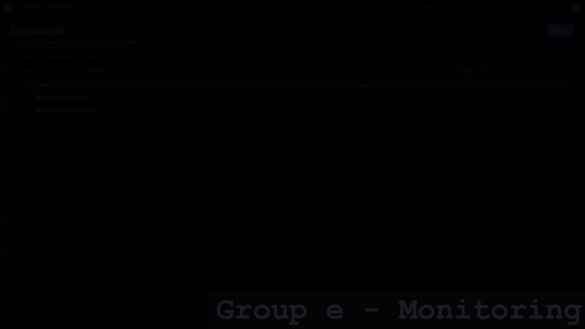
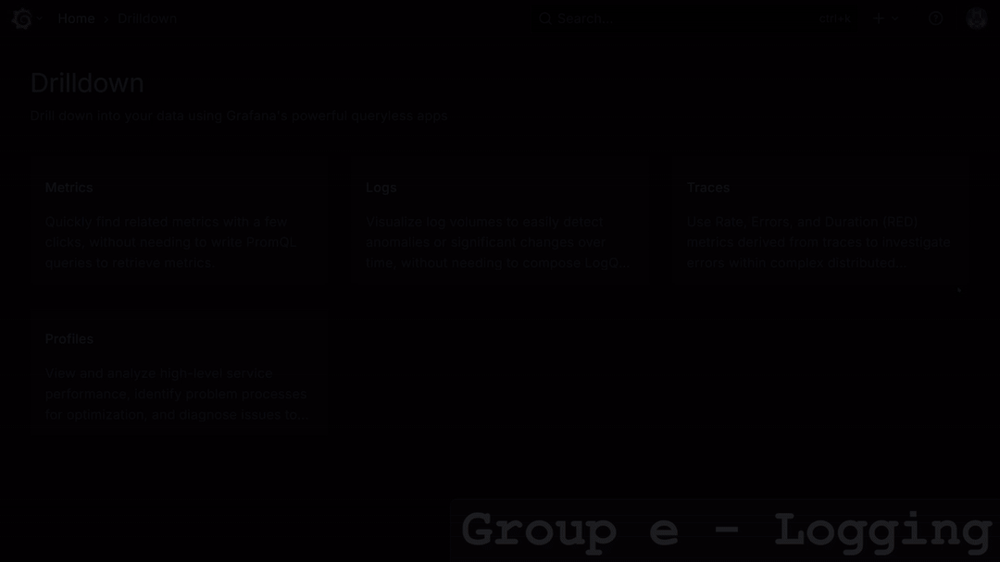
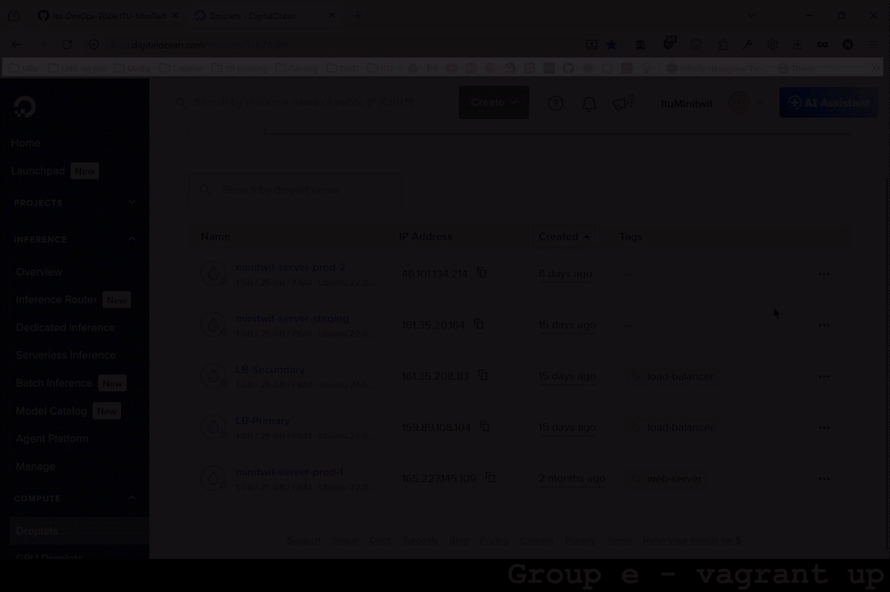

# Prerequisites
You need to have vagrant version 2.4.9 & dotnet 8 installed.
 
Ensure you have a Digital Ocean token and SSH key.

# Cloning the repository
Run `git clone git@github.com:Itu-DevOps-2026/ITU-MiniTwit.git`
 
`cd ITU-MiniTwit` 

# Setup environment variables
Create a .env file in root of the repository:
 
`DIGITAL_OCEAN_TOKEN=<token>`
 
`SSH_KEY_NAME=<key_name>`
 
Load the variables
 
`source .env`

# Provision VM
Run `vagrant up`

# Running locally
Navigate to the `src/MiniTwit.Web` folder.
 
Run `dotnet run`

# Video Demonstrations

## Monitoring Dashboards

## Logging Dashboards

## IaC - `vagrant up`

## CI/CD
