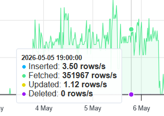

---
title: "ITU-MiniTwit - Group e - Report"
author: "Frederik Hørup <frap>, Marie Johansen <majoh>, Nikolej Lundquist <nivl>, Sara Bagger <salb>, Vitus Brodersen <>"
date: \today
---

# Introduction

_Authors: _

# System

## Architecture and Design

_Authors: _

## Dependencies

_Authors: _

## System States

_Authors: _

# Process

## CI/CD

_Authors: _

## Monitoring

_Authors: _

## Logging

_Authors: _

## Security

_Authors: _

## Availability and Scaling

_Authors: _

# Reflection

_Authors: _

## Evolution and refactoring

_Authors: Frederik_

For the simulator to work there needed to be added some new endpoints which were specified in the swagger documentation. To make the work easier the OpenAPI Generator CLI tool was used and the different endpoints specialized in what was expected of them. Furthermore, authorization using a basic token was implemented to set up for the different endpoints that need it.

The database for the application was a SQLite database running in the minitwit application. That meant that the persisted data the database was holding got deleted when a new deploy of the application occurred. There was therefore a need to migrate to a new database type so the data is persisted. It was chosen to migrate to a MySQL database which was hosted using Digital Ocean. This was chosen for its simplicity and time effectiveness for the group.

## Operations

_Authors: Frederik_

Checking monetoring and logs often to see if there is exes strain on the system and if any errors have been thrown. Furthermore check of the status page to see if any errors has been thrown by the simulator that the loging did not catch.

## Maintenance

_Authors: Fredrik_

api errors

We were made aware that Grafana was returning an internal server error when trying to log in. It was discovered that Prometheus had filled the droplets storage so it could not try to access the internal volume to log in. To fix this a folder docker uses to write data to was deleted and the docker containers on the VM were restarted. To make sure this did not happen again storage retention was added Prometheus got its own volume. To see the whole bug report see issue [#81](https://github.com/Itu-DevOps-2026/ITU-MiniTwit/issues/81).

After seeing that the application was down, the first thing that was done was check the logs. Here it could be seen that the reason for the application was due to thread pool starvation. Looking more at the logs it could be seen that a request to the application was taking upwards of 46 minutes. By looking at the database, it could be seen that it was fetching 200.000+ lines per second. It was therefore decided that the database needed to be indexed to combat this issue. After this was implemented and the application restarted it was up and running smoothly. The full bug report can be found on issue [#99](https://github.com/Itu-DevOps-2026/ITU-MiniTwit/issues/99)

## Reflect and describe what was the "DevOps" style of work

# Use of Generative AI

_Authors: Nikolej_

During the development of this project we used ChatGPT in two main ways:

**Debugging.** Often when encountering unexpected bugs and error messages,
we would consult ChatGPT about the cause and potential fixes
While it could rarely fix the issues entirely by itself, more often than not,
it pointed us in the right direction.

**Research.** This course presents challenges involving numerous technologies,
most of which we were unfamiliar with. As such, ChatGPT was used to summarize lengthy documentation
and provide concrete guides tailored to our situation.

**Generating boilerplate / configurations.** ChatGPT was also used for simple tasks
like generating boilerplate code or writing Github Actions Workflow files.
For example, the `build-report.yml` workflow, that converts the markdown source into a pdf.

The use of AI has made these tasks easier, spared us many frustrations and saved consiberable time during development.
On the flip side, AI may have deprived us the extensive knowledge and experience you gain by,
for example, painstaking reading of documentation or spending hours resolving a tiny bug.
