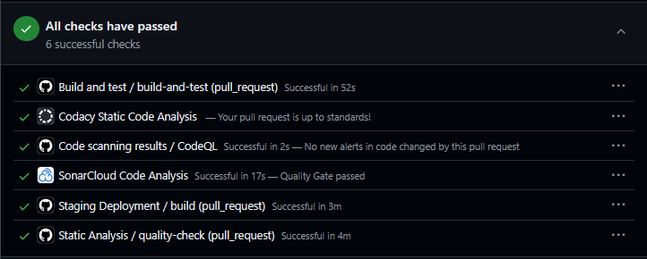

---
title: "ITU-MiniTwit - Group e - Report"
author: "Frederik Hørup <frap>, Marie Johansen <majoh>, Nikolej Lundquist <nivl>, Sara Bagger <salb>, Vitus Brodersen <>"
date: \today
---

# Introduction

_Authors: _

# System

## Architecture and Design

_Authors: Nikolej_

This project is a forked repository of the Chirp! project [@chirp] developed for the course
"Analysis, Design and Software Architecture (Autumn 2025)".
The MiniTwit application architecture, namely the domain model and codebase structure,
is inherited unchanged from the Chirp! project.
Hence, we refer to the diagrams compiled in the Chirp! project report, inserted below for convenience.

_Illustration of the *Chirp!* Domain Model (reused from the Chirp! project - not compiled during this course)._

_Illustration of the Chirp! app codebase structure - based on onion architecture (reused from the Chirp! project - not compiled during this course)._

## Deployment

_Authors: Nikolej_

Below is a diagram of the overall deployment architecture of the MiniTwit application.
The system uses two load balancers and two production server instances each running all containerized services and
both read and write to the same DigitalOcean Managed Database.

This setup is designed to prioritize availability.
One can imagine the stakeholders of a social media platform pushing for availability,
since every second of downtime is potential earnings lost.

The dual load balancer (LB) setup was chosen for this reason.
The primary load balancer initially handles all traffic, but is replaced by the secondary in case of failure.
This is enabled through the heartbeat messages exchanged between the two using VRRP.
The secondary then takes ownership of the reserved IP and resumes operation.
Essentially, one LB is active while the other is on standby,
which keeps the system online and reduces one potential single point of failure.

The same principle is applied to the application layer, by using two MiniTwit production servers.
Both run the exact same services and both are connected to the same database,
which enables traffic to be served by either instance.
This provides redundancy in case one server fails,
allowing the team to bring it back up while the other instance continues to handle traffic.

However, there is one major drawback to this setup. The monitoring stack is duplicated as well.
Logs and metrics for each server are separate, which compromises observability consistency.
If one server goes down, logs and metrics may be lost.
This could be fixed by having a centralized monitoring stack e.g. on a separate device that all application nodes
export to.

Conversely, since both production serves run identical containerized environments,
the system is easily reproducible and scalable.

While the monitoring and logging data is not strictly centralized, the app database itself is.
DigitalOcean provides a service for database hosting reducing the maintenance burden on the group.
This allows focus on other aspects of the project rather than database administration,
in exchange for some loss of control.

_MiniTwit Deployment Diagram_

## Dependencies

_Authors: Marie, Frederik, Nikolej, Sara_

Besides the .NET packages used to make the MiniTwit application run,
which can be seen [here](#net-dependencies).
The most important dependencies can be seen below, categorized by type.

*Note: Some, like Docker, can fall into more than one category.*

**Workflow**

- GitHub Actions - CI/CD automation platform to run workflows
- rsync - File synchronization tool

**Deployed**

- DigitalOcean - Cloud hosting provider used to host servers and the database
- Docker - Containerization platform
- Docker Hub - Cloud-based registry for storing and sharing Docker Images
- Nginx - High performance web server and reverse proxy
- Keepalived - High availability and failover service
- Certbot - Tool for automatically issuing and renewing SSL/TLS certificates
- Grafana - Visualization platform for logs and monitoring
- Prometheus - Monitoring service used to collect and store metrics from infrastructure and applications
- Loki - Log aggregation and storage system
- Alloy - Telemetry collector used to collect and forward logs
- Ubuntu - Linux distribution used on our servers
- MySQL - Relational database management system
- Vagrant - Tool for creating and managing reproducible virtualized development environments

**Static Analysis**

- Hadolint - Linter for Dockerfiles
- CSharpier - C# code formatter
- CodeQL - Static analysis engine used to identify security vulnerabilities and code quality issues
- Roslyn - .NET compiler platform for code analysis
- Docker Scout - Security and vulnerability analysis tool for Docker
- SonarCloud - Cloud-based code quality and security analysis platform
- Codacy - Automated code review and quality monitoring platform

**Development**

- Git - Distributed version control system
- GitHub - Web-based platform for hosting Git repositories
- .NET - Microsoft’s development platform and runtime used to make the minitwit application

## System States

_Authors: Vitus_

The project is currently in a good state quality wise.
We have from the beginning focused on always having our tests and static analysis tools accept incoming changes before being allowed to be merged into a production state. 
Even going as far as to set multiple analysis tools to strict. 
As of now, the entire project is compliant with these criteria, and can thus be considered stable. 
Any crashes we have encountered in this project have been interogated and the leading issues fixed.

There have been a few compromises and temporary bending of these quality gating rules. 
The project is developed on top of the Chirp! platform, which was specifically made for dotnet 8, that has become deprecated and outdated since then, having moved onto dotnet 10.
This means that the Docker Scout scan of the image strongly recommends us to update. We have therefore chosen to make the analysis ignore said category explicitly. 
This is not a breaking issue, as long as we keep this in mind.

Below is the latest static analysis checks at the time of writing.

_System checks on the recent-most change_

# Process

## CI/CD

_Authors: _

## Monitoring

_Authors: _

## Logging

_Authors: _

## Security

_Authors: _

## Availability and Scaling

_Authors: _

# Reflection

_Authors: _

# Use of Generative AI
_Authors: Nikolej, Sara_

During the development of this project we used ChatGPT in three main ways:

**Debugging.** When encountering unexpected bugs and unclear error messages,
we often consulted ChatGPT about possible causes and fixes.
While it rarely solved issues entirely on its own, it frequently helped narrow down the problem space and suggested relevant debugging strategies.

**Research.** This course presents challenges involving numerous technologies,
many of which we were unfamiliar with, including monitoring tools, docker and load balancing.
ChatGPT was used to summarize lengthy documentation, explain unfamiliar concepts, and provide concrete guides tailored to our situation.

**Generating boilerplate / configurations.** ChatGPT was also used for simple, repetitive tasks
such as generating boilerplate code or writing Github Actions Workflow files.
For example, the `build-report.yml` workflow, that converts the markdown source into a pdf.

The use of AI has made these tasks easier, spared us many frustrations during troubleshooting and saved considerable time during development.
At the same time, we met certain limitations when using AI. Suggested fixes sometimes appeared plausible while being incorrect or incompatible with our setup. 
Additionally, relying on AI summaries may have reduced some of the deeper understanding that can come from manually reading documentation or solving problems independently, like spending hours solving a tiny bug. 
As a result, we found that generative AI was most useful as a supporting tool rather than a replacement for critical thinking, testing, and technical understanding.

# References

## .NET dependencies 

Dependencies of ITU-MiniTwit according to `dotnet list package`:

Project 'MiniTwit.Core' has the following package references
[net8.0]: No packages were found for this framework.

Project 'MiniTwit.Infrastructure' has the following package references  
 [net8.0]:
Top-level Package Requested Resolved

> Microsoft.AspNetCore.Identity.EntityFrameworkCore 8.0.21 8.0.21  
> Microsoft.Data.Sqlite 8.0.8 8.0.8  
> Microsoft.Data.Sqlite.Core 8.0.8 8.0.8  
> Microsoft.EntityFrameworkCore 9.0.0 9.0.0  
> Microsoft.EntityFrameworkCore.Design 9.0.0 9.0.0  
> Microsoft.EntityFrameworkCore.Sqlite 8.0.8 8.0.8  
> Microsoft.EntityFrameworkCore.Tools 9.0.0 9.0.0  
> Pomelo.EntityFrameworkCore.MySql 9.0.0 9.0.0  
> SQLitePCLRaw.bundle_e_sqlite3 3.0.2 3.0.2

Project 'MiniTwit.Web' has the following package references
[net8.0]:
Top-level Package Requested Resolved

> AspNet.Security.OAuth.GitHub 8.3.0 8.3.0  
> DotNetEnv 3.1.1 3.1.1  
> Microsoft.AspNetCore.Identity.EntityFrameworkCore 8.0.21 8.0.21  
> Microsoft.AspNetCore.Identity.UI 8.0.21 8.0.21  
> Microsoft.Data.Sqlite 8.0.8 8.0.8  
> Microsoft.Data.Sqlite.Core 8.0.8 8.0.8  
> Microsoft.EntityFrameworkCore 9.0.0 9.0.0  
> Microsoft.EntityFrameworkCore.Design 9.0.0 9.0.0  
> Microsoft.EntityFrameworkCore.Sqlite 8.0.8 8.0.8  
> Microsoft.EntityFrameworkCore.Tools 9.0.0 9.0.0  
> Microsoft.Playwright.NUnit 1.43.0 1.43.0  
> Microsoft.VisualStudio.Web.CodeGeneration.Design 9.0.0 9.0.0  
> Pomelo.EntityFrameworkCore.MySql 9.0.0 9.0.0  
> prometheus-net.AspNetCore 8.2.1 8.2.1  
> Serilog.AspNetCore 8.0.3 8.0.3  
> Serilog.Sinks.Console 6.1.1 6.1.1  
> Serilog.Sinks.Grafana.Loki 8.3.2 8.3.2  
> SQLitePCLRaw.bundle_e_sqlite3 3.0.2 3.0.2  
> Swashbuckle.AspNetCore 10.1.2 10.1.2  
> Swashbuckle.AspNetCore.Annotations 10.1.2 10.1.2  
> Swashbuckle.AspNetCore.SwaggerGen 10.1.2 10.1.2
